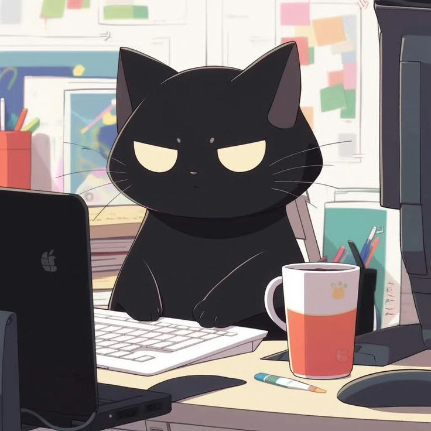

 ## Здравствуйте!



Меня зовут Татьяна. Я люблю котов. 

Область интересов:

Програмирование, а именно создание сайтов , мобильные приложения, пушистые и милые котики.

 ### Языки программирования которые знаю:
   * PHP
   * Dart (Flutter)
   *  C++ 

   могу написать программу "Hello, World!" на C++

```
   #include <iostream>

int main() {
    std::cout << "Hello, World!" << std::endl;
    return 0;
}
```
   * Js
* ### Которые изучаю:
   * Dart
   * Java
* ### Которые хочу изучать:
   * Dart
   * PHP

Связаться можно через: ivanenkotatana830@gmail.com, 

###### но я ее редко проверяю 🤣🤣🤣
